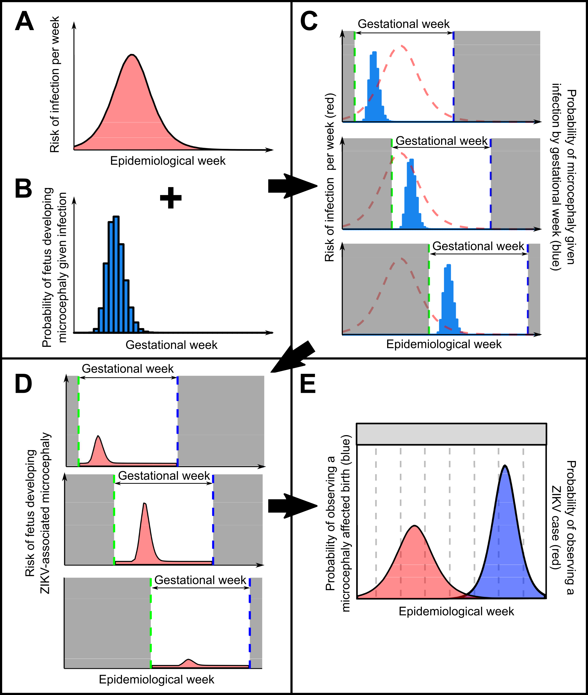
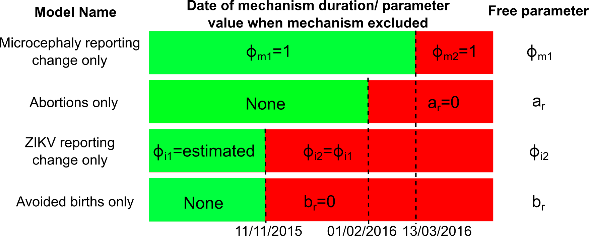

```{r setup, echo=FALSE}
library(kableExtra)
library(knitr)
options(knitr.table.format = "html")
vital_statistics <- read.csv("vital_statistics.csv")
```
# Introduction
This vignette describes the methodology and data behind the [`zikaProj`](https://github.com/jameshay218/zikaProj) R package.

# Model description
We developed a two-component model to describe the relationship between the incidence of ZIKV infection and the incidence of microcephaly-affected births, as depicted in Figure 1. Our aim was to estimate the shape and size of the “window of risk” for developing ZIKV-associated microcephaly given infection during gestation, and to test for differences in incidence and risk as predicted by different data sets from various Brazilian states and Colombia.


{width=500px}

*A: time varying risk of ZIKV infection generated from an SEIR model, as described in the Methods; B: risk of microcephaly given infection by week of gestation at time of infection; C: link between risk of infection in real time and microcephaly risk in gestational time. Dashed red line shows time varying risk of ZIKV infection, blue bars show microcephaly risk given infection, shaded grey region shows time before and after pregnancy, green dashed line shows conception time, blue dashed line shows expected birth date; D: Time varying risk of microcephaly given ZIKV infection by epidemiological week for the same three example pregnancies, found by multiplying the risk of infection in a given epidemiological week (curve A) by the risk of microcephaly given infection in that week of gestation (curve B). Dashed blue line shows expected birth (observation) date; E: Combined probability of observing a microcephaly affected birth in a given epidemiological week (blue), giving expected proportion of microcephaly affected births. Red area shows probability of ZIKV infection by epidemiological week.*

## Transmission model
The first component of the model captured the transmission dynamics of ZIKV via the *Aedes aegypti* mosquito vector. The model was based on the Ross-MacDonald model for vector-borne disease, capturing deterministic SEIR dynamics in humans with transmission via the mosquito vector experiencing SEI dynamics.[@MacDonald1957] Using a transmission model to approximate per capita infection risk rather than assuming that reported rates were equal to infection risk has two benefits: 

1. Model fitting can be done based on information inherent in the shape of the curve (width, growth rate) rather than its magnitude. This means that, assuming the reported incidence is a good estimate of the shape of the epidemic curve even if the magnitude is not an accurate reflection of the true incidence (misreporting), we can fit the model to reported data. By adding an additional parameter to scale the magnitude of the model-predicted incidence curve (ie. proportion of true cases reported), we produce an estimate for the true time-varying risk of ZIKV infection.

2. By fixing some of the model parameters based on the literature (Table 1), we can infer values for the basic reproductive number, $R_0$, and the epidemic seed time, $t_0$. 

The model is defined by the following set of ODEs:

\begin{equation}
\begin{array}{lr}
\frac{dS_M}{dt} = \mu_MN_M - \mu_MS_M - \lambda_MS_M \\
\frac{dE_M}{dt} = \lambda_MS_M - \sigma_ME_M - \mu_ME_M  \\
\frac{dI_M}{dt} = \sigma_ME_M - \mu_MI_M \\
\\
\frac{dS_H}{dt} = \mu_HN_H - \lambda_HS_H - \mu_HS_H\\
\frac{dE_H}{dt} = \lambda_HS_H - \sigma_HE_H - \mu_HE_H\\
\frac{dI_H}{dt} = \sigma_HE_H - \gamma_HI_H - \mu_HI_H\\
\frac{dR_H}{dt} = \gamma_HI_H - \mu_HR_H\\
\end{array}
\label{eq:seir}
\end{equation}


Where \emph{S, E, I} and \emph{R} indicate the number of individuals in the susceptible, exposed, infected or recovered compartment, and the subscript represents either human (H) or mosquito (M) populations; $N$ is the total population size; $\mu$ is the birth/death rate; $\sigma$ is the incubation period; $\gamma$ is the infectious period; and $\lambda$ is the force of infection. We assumed that each location (typically a Brazilian state) was a closed, homogeneously mixing population with constant population size. 

{width=500px}

*Mosquito vector population is shown in green, with new mosquitoes entering the susceptible class (S\textsubscript{M}) and progressing through to the infected state. The human population is shown in blue, with new humans entering as susceptible (S\textsubscript{H}). Humans become infected at a rate of $\lambda_H$, and become infectious at a rate of $\alpha_H$. Humans then recover at a rate of $\gamma_H$. Note that the force of infection on humans comes from mosquitoes only, as represented by the orange arrows. All compartments experience a death rate of 1/L, where $L$ is the lifespan in days.*

Through calculation of the force of infection over time, we estimated a per capita risk of infection per unit time. The force of infection for mosquitoes and humans respectively is given by:

\begin{equation}
\begin{array}{lr}
\lambda_M = bp_{HM}I_H \\
\lambda_H = bp_{MH}I_M
\end{array}
\end{equation}

Where $b$ is the bite rate per vector; $p_{MH}$ is the probability of a bite generating an infection in a human from an infected vector; $p_{HM}$ is the probability of a bite generating an infection in a vector from an infected human; and $I_H$/$I_M$ is the number of infected humans/mosquitoes. Using this force of infection term, we generated the probability of an individual becoming infected in a given week:[@Diekmann2000]

\begin{equation}
 F(t) = \exp(\int_{t_0}^t -\lambda_H(t)dt)
\end{equation}

Where $F(t)$ is the probability of remaining susceptible between $t_0$ and $t$, and:

\begin{equation}
P_{I}(t) = F(t-dt)(1-F(t))
\end{equation}

Where $P_I(t)$ is the probability of becoming infected at a given time, $t$, given by the probability of remaining susceptible up to that point multiplied by the probability of not remaining susceptible at $t$.

The basic reproductive number, $R_0$, was defined as the number of new human infections generated by the introduction of a single infected human into a naive human and mosquito population given by:[@Keeling2009]
\begin{equation}
R_0 = \frac{b^2p_{HM}p_{MH}N_M}{\mu_M(\sigma_M + \mu_M)(\gamma_H + \mu_H)N_H}
\end{equation}

Where $N_M$ is the total number of mosquitoes; $N_H$ is the total number of humans; $\mu_M$ is the birth/death rate of mosquitoes; $\sigma_M$ is the rate at which mosquitoes leave the exposed class; $\gamma_H$ is the rate at which humans leave the infected class; and $\mu_H$ is the birth/death rate of the human population. Critical values for $R_0$ were used to validate model implementation (values at, just above and below 1). We also validated the use of $R_0$ within the standard final-size equation to calculate the proportion of exposed individuals at the end of a single epidemic peak, which allowed to the calculation the final attack rate based on $R_0$.[@Diekmann2000]

All biological parameters related to transmission properties and course of infection were assumed to be the same for all locations, whereas parameters relating to life expectancy, population size, vector density (the free component of $R_0$) and seeding time ($t_0$) were estimated and assumed to be location specific. Life expectancy and population size were assumed to be known and fixed based on official statistics.[@BrazilLifeExpectancy, @BrazilPopulationSize, @ColombiaLifeExpectancy, @ColombiaPopulationSize] We assumed a fixed mosquito lifespan of 5 days, and fixed other model parameters such that the generation time of ZIKV was assumed to be ~20 days in line with previously published analyses on Zika transmission.[@Ferguson2016] A sensitivity analysis was run where mosquito lifespan was fixed at 7 days, but this did not have a significant impact on the inferred microcephaly risk curve, although we note that $R_0$ estimates are conditional on the assumed generation time. A table summarising the chosen model parameters and their sources can be found in Table 2.

## Microcephaly risk model
The second component of the model described the risk of a fetus developing microcephaly given that the mother was infected in a particular week during pregnancy. Fitting this risk profile as a curve rather than a set of per-trimester risk estimates captures more information regarding the width and shape of the gestational-time-varying risk profile and the resolution of weeks or days rather than per trimester. We used a scaled gamma distribution to characterise the shape and scale of this curve with only 3 free parameters - the shape, scale, and an additional scaling constant to increase the magnitude of the curve. This additional scaling constant was required as the sum under the risk curve did not need to sum to 1 as in the unmodified gamma distribution. The probability of developing microcephaly given infection was described as:

\begin{equation}
P'_m(x) = \frac{c}{\Gamma(x)\theta^k }x^{k-1}e^{-\frac{x}{\theta}}
\end{equation}

Where $P'_m(x)$ is the probability of developing microcephaly given infection in gestational week $x$ (0 to 39, where 0 is the first week of pregnancy); $c$ is an additional scaling constant; $\theta$ is the gamma scale parameter; and $k$ is the gamma shape parameter. The gamme distribution was chosen due to the flexible shape of the curve defined by a small number of parameters. Note that $\theta$ and $k$ can be trivially manipulated to give the mean, mode and variance of the gamma curve. The gamma distribution, $\Gamma$ was defined as:

\begin{equation}
\Gamma ( x ) = \int\limits_0^\infty {t^{x - 1} } e^{ - t} dt
\end{equation}

## Combined model
Based on the transmission model and microcephaly risk model, the expected proportion of microcephaly affected births (Figure 1E) was calculated by multiplying these two components together. The probability of ZIKV-associated microcephaly affected birth at time, $t$, was therefore given by:

\begin{equation}
 P_m(t) = \sum^t_{i=t-40} P_I(i)P'_m(40 + t - i)
\end{equation}

Where $P_m(t)$ is the probability of a ZIKV-associated microcephaly birth at time $t$, $P_I(i)$ is the probability of an individual becoming infected at time $i$ (and not before), and \(P'_m(40+t-i)\) is the probability of fetus developing microcephaly given ZIKV infection at gestational week $40+t-i$. Essentially, the probability of a live birth being affected by ZIKV-associated microcephaly is the sum of all of the opportunities that the mother could have been infected and the fetus subsequently developed microcephaly in each of the 40 weeks of pregnancy preceding the birth.

Including a baseline microcephaly rate (ie. not associated with ZIKV) gives the probability of observing any microcephaly case at time $t$ as:

\begin{equation}
 P_{micro}(t) =\phi_{m,i}(1 - (1-P_m(t))(1-P_b))
\end{equation}

Where $P_b$ is the baseline per birth microcephaly incidence rate and $\phi_{m,i}$ is the proportion of true cases that were reported in location $i$ (less than one indicates underreporting, greater than one indicates overreporting). Multiplying this proportion by the total number of live births at time $t$, $B(t)$, gives the expected number of observed microcephaly-affected births at time $t$.

# Data
## Microcephaly and ZIKV incidence data
We searched the literature and Brazilian state health authority websites for reports of suspected ZIKV incidence and microcephaly cases in 2015 and early 2016, building on a comprehensive literature search performed in 2016.[@Ferguson2016] In particular, we searched (www.paho.org)[www.paho.org], (www.who.int)[www.who.int], Brazilian state-level ministry of health websites (eg. (www.suvisa.ba.gov.br)[www.suvisa.ba.gov.br]), and PubMed for the terms "zika" and "microcephaly". ZIKV and microcephaly incidence data from 2015 were available from publications and epidemiological reports for the states of Pernambuco, Rio Grande do Norte and Bahia (at state level and for the city of Salvador), though no data sets from 2015 were found for any other state. Monthly microcephaly incidence and births by state was also found online from the SINASC/CGIAE/SVS/MS system as reported previously.[@Johansson2016, @Zoca2016] An additional source of ZIKV incidence for all Brazilian states was also obtained from a publication in 2016; however the timing of the epidemic peak in these data was not consistent with state-level reports, suggesting that incidence peaked in July 2015, contrasting with state-level reports which suggested an earlier peak.[@Faria2016] We also considered ZIKV and microcephaly incidence data published from the Brazilian ministry of health, which suggested a ZIKV peak time in line with the data from Faria et al.[@deOliveira2017] Finally, we obtained microcephaly and ZIKV incidence data for Colombia at the national level.[@PahoColombia, @Cuevas2016] Where specified, we used the definition for "suspected microcephaly cases" as the measure of incidence, as a reporting rate parameter was included in the model that accounts for overreporting. Although this choice of measure may result in an overestimate for the magnitude of microcephaly risk, our focus was on the timing and shape of the risk curve rather than the level of absolute risk. 

A summary of data included in the analyses can be found in Table 1. Some data sources were only available in graphical form, and these numbers were therefore extracted using a web digitizer available at (https://automeris.io/WebPlotDigitizer/)[https://automeris.io/WebPlotDigitizer/]. The results presented in the main text used data from Northeast Brazil, weekly microcephaly incidence from Colombia, state-reported weekly microcephaly incidence from Bahia, Brazil, and state-reported monthly microcephaly incidence from Rio Grande do Norte. Model fitting using the other data sources for the same locations, as well as fitting a single microcephaly risk curve to data from multiple locations simultaneously, was carried out but results are not presented here. Different data sources for the same location produced qualitatively similar risk curve estimates in terms of the window and timing of risk.

Numbers of live births were obtained for Brazil from the SINASC/CGIAE/SVS/MS system.[@Johansson2016, @Zoca2016] For Colombia, live births were obtained from a publication of microcephaly and ZIKV incidence in Colombia.[@Cuevas2016] Where reporting of live births was incomplete, we estimated the number of live births by averaging the number of births in the previous two years for the same dates.

## Model parameters
Model parameters related to ZIKV transmission were obtained from the literature as described in Table 2. Parameters were predominately chosen based on a previously published transmission model, with point values adjusted to give a generation time of approximately 20 days.[@Ferguson2016] Given a fixed generation time, the shape of the SEIR model predicted incidence curve was allowed to vary depending on the value of $R_0$. As $R_0$ is comprised of multiple correlated parameters, all components of $R_0$ other than the vector density per human were fixed at arbitrary values.

## Vital statistics

# Model fitting
Using the expected number of observed microcephaly cases as described above, we fit the model to available microcephaly incidence and live birth data to estimate model parameters. The likelihood function and fitting algorithm are described below.

## Mirocephaly incidence likelihood
The log likelihood of observing a time series of microcephaly cases for a given location $i$ was given by:

\begin{equation}
L(D_i|\theta_i, \theta) = \sum_t \log P(d_t|\theta_i,\theta)
\end{equation}

Where $D_i$ is the observed number of microcephaly cases over time; $D_i=\left \{d_t\right \}^T_{t=1}$; $d_t$ is the number of microcephaly cases observed at time $t$; $\theta_i$ is the set of location-specific parameters (eg. mosquito density) and $\theta$ is the set of universal model parameters that apply to all locations (eg. $p_{MH}$). Observed microcephaly incidence was assumed to be binomially distributed such that:

\begin{equation}
P(d_t) \sim B(n=n(t),p=P_{micro}(t))
\end{equation}

Where $n(t)$ is the total number of births observed at time $t$ which was known; and $P_{micro}(t)$ is the proportion of microcephaly affected births at time $t$ as defined by the model parameters $\theta$; and $B$ is the binomial probability mass function. 

## ZIKV incidence and combined likelihood
Note that the reporting proportion parameter, $\phi_{m,i}$ was assumed to be location-specific as described above. Note also that this likelihood is easily extended to incorporate ZIKV incidence data as well as microcephaly incidence data $I_i = \left \{i_t\right \}^T_{t=1}$ as:

\begin{equation}
L(D_i, I_i|\theta_i, \theta) = \omega \sum_{t_m} \log P(d_t|\theta_i, \theta) + (1-\omega)\sum_{t_i} \log P(i_t|\theta_i, \theta)
\end{equation}

Where $I_i$ is the set of ZIKV incidence data for location $i$; $\theta_i$ is the set of location-specific model parameters; $\theta$ is the vector of universal model parameters; and $\omega$ is an optional weighting parameter that scales the contribution of the ZIKV incidence data to the likelihood. $t_m$ and $t_i$ indicate that microcephaly and ZIKV incidence data do not necessarily cover the same observation period (as ZIKV incidence would predate microcephaly incidence).

The binomial likelihood of observing a ZIKV case at a given time, $t$ is given by:

\begin{equation}
P(i_t) \sim B(n=N, p=\phi_{I,i} P_I(t))
\end{equation}

Where $i_t$ is the observed ZIKV incidence at time t; $\theta$ is the vector of model parameters; $N$ is the total population size; $\phi_{I,i}$ is the state-specific proportion of true ZIKV cases that observed incidence represents (through under or overreporting, or misdiagnosis) and $P_I(t)$ is the model predicted probability of becoming infected at time $t$ as described above.

The complete likelihood function combining information from all included locations in the model was given by:

\begin{equation}
P(D|\theta) = \sum_{n=i}L(D_i,I_i|\theta_i,\theta)
\end{equation}

Where $D=\left \{D_i\right \}^n_{i=1}$; $D_i$ is the microcephaly incidence data from location $i$; $I=\left \{I_i\right \}^n_{i=1}$; $I_i$ is the ZIKV incidence data from location $i$; $\theta_i$ is the set of location-specific parameters; $\theta$ is the set of universal model parameters; and $n$ is the number of locations included in the analysis. 

Using the above likelihood, we defined the posterior probability function to be:

\begin{equation}
P(\theta|D,I) = P(\theta_i, \theta)\sum_{n=i}L_i(D_i, I_i|\theta_i, \theta) 
\end{equation}

Where $P(\theta)$ is the prior probability of the model parameters. Note that the prior probability sits outside of the summation. We assumed uniform priors for all free model parameters with upper and lower bounds described in Table 2.

## Model fitting without ZIKV incidence data
We were able to fit the model to microcephaly incidence data alone by setting the weighting of the ZIKV incidence component, $\omega$, of the likelihood to 0. However, some knowledge of the timing of the ZIKV epidemic peak was available for some locations based on reported incidence. In these analyses, we incorporated information on the timing of ZIKV epidemic peak to help constrain the timing of peak infection risk. This peak time can be considered a function of the SEIR model parameters (ie. the peak of ZIKV incidence generated by the SEIR model). This was used to inform a uniform prior distribution as follows:

\begin{equation}
p(t_{peak}) \sim unif(a - \frac{b}{2},a + \frac{b}{2})
\end{equation}

Where $t_{peak}$ is the model generated ZIKV peak incidence time; $a$ is the believed peak time of the ZIKV epidemic in that location based on the day of maximum reported ZIVK incidence; and $b$ is the width of the uniform window around this peak time. Here, we chose $b$ to be 60 days to represent a 2 month window of uncertainty around the timing of the ZIKV epidemic peak.

## MCMC algorithm
Using the equation above, we defined a binomial likelihood of observing a number of microcephaly cases at any unit time given a set of model parameters and known number of births. We defined the likelihood function such that we could calculate the combined likelihood of observing ZIKV and microcephaly incidence data from any number of geographical locations conditional on both universal and location-specific parameters. Furthermore, we incorporated the potential for location specific over and underreporting through reporting rate parameters, $\phi_I$ and $\phi_m$. Total births were either known from the data, or estimated by taking the average of the previous two years' births in the same time period. Where weekly birth data was required from monthly data, we evenly spread the monthly number of births across the number of days in that month and then summed the number of births for each 7 day block. 

Using this likelihood function, we fit the model to available incidence data using an MCMC framework written in R and C++ ([`lazymcmc`](https://github.com/jameshay218/lazymcmc)) with the [`rlsoda`](https://github.com/richfitz/rlsoda) package. Chains were run for 2000000 iterations with a 750000 iteration burn in and adaptive period. The chains were run to ensure that a sufficient effective sample size was achieved for all model parameters or at least 200, with convergence assessed using the Gelman-Rubin diagnostic tool with the coda package in R. The result of this analysis was posterior distribution estimates for all free model parameters conditional on the included data.

# Forecasting the second wave of microcephaly incidence
We added four additional model parameters to quantify potential changes in behaviour and reporting rates across two seasons of microcephaly and ZIKV incidence that would explain the two seasons of observed data, where only one wave of microcephaly incidence was observed despite two waves of ZIKV incidence. We tested the following hypotheses:

1. Microcephaly reporting accuracy was different before the most recent change in microcephaly case definition on 13/03/2016 for cases reported through the Registro de Eventos em Saúde Pública (RESP) database in Brazil. Under/over-reporting of microcephaly may therefore have been different before and after this date.
2. Following the WHO announcement of a Public Health Emergency of International (PHEIC) concern on 01/02/2016, women may have begun to seek targetted abortions for microcephaly affected pregnancies <12 weeks of gestation, which would manifest itself as a probability of seeking an abortion given development of ZIKV-associated microcephaly in a particular week of pregnancy.
3. The proportion of ZIKV-affected births after 11/11/2015 may have decreased relative to reported per capita ZIKV incidence, either through pregnant women taking additional precautions to avoid infection relative to the rest of the population or through delaying pregnancy entirely.
4. ZIKV incidence reporting accuracy may have changed after 11/11/2015 after the WHO/PAHO issued an alert accompanied by improved laboratory detection guidelines for ZIKV. Under/over-reporting of ZIKV infection may therefore have been different before and after this date.

We define the probability of not developing microcephaly during the first $j-t+40$ days of pregnancy as $\bar{b_p} = (1-bp)^{j-i+40}$. We also make the following notational simplification: $P_m^A = P_I(i)P'_m(t - i + 40)$. The expected proportion of observed microcephaly affected live-births was therefore given by:

\begin{equation}
P_{micro}(t) = \phi_{m}\sum^t_{i=t-40}\left\{\begin{array}{lr}
\bar{b_p}(P_m^A + b_pP_m^A + b_p) & t < t_{switch} \\\\
(1-a_r)\bar{b_p}((1-b_r)P_m^A + b_p(1-b_r)P_m^A + b_p) & t \geq t_{switch} \hspace{0.1cm}\&\hspace{0.1cm} (i -t+ 40) <  t_{abortion}\\\\ 
\bar{b_p}((1-b_r)P_m^A +b_p(1-b_r)P_m^A + b_p) & t \geq t_{switch} \hspace{0.1cm}\&\hspace{0.1cm}(i-t+ 40) \geq  t_{abortion}
\end{array}
\right.
\end{equation}

Where $P_I(i)$ is the probability of becoming infected at time $i$; $P'_m(i-t+40)$ is the probability of developing microcephaly given infection in gestational week $i-t+40$; $t_{switch}$ is the time at which behavioural changes could have occurred (assumed to be 01/02/2016, mechanism 3); $b_r$ is the proportion of potentially affected births that were avoided (mechanism 3); $a_r$ is the proportion of microcpehaly-affected births that were aborted (mechanism 2); and $t_{abortion}$ is the gestational time before which abortions could occur, assumed to be 12 weeks (mechanism 2); $b_p$ is the baseline daily *probability* of developing microcephly during pregnancy (note that this is different to the previous definition of baseline microcephaly, which was defined as a rate per observed live birth rather than a probability). 

Overall, this term gives the probability of an individual not developing baseline microcephaly during the first $j-i+40$ days of pregnancy and either developing ZIKV-associated microcephaly, baseline microcephaly or both on that day. This term is then multiplied by the probability of observing that microcephaly case (ie. the reporting rate), given by $\phi_m$, which was assumed to have one value before and one after 13/03/2016 (mechanism 1). 

As our model did not explicitly include seasonality, we used reported ZIKV incidence directly to estimate the per capita infection risk across two seasons. We calculated the probability of becoming infected with ZIKV as:

\begin{equation}
P_I(t) = \left\{\begin{array}{lr}
\frac{I(t)}{\phi_{inc_1}} & t < t_1\\\\
\frac{I(t)}{\phi_{inc_2}} & t \geq t_1\\
\end{array}
\right.
\end{equation}

Where $I(t)$ is the observed per capita ZIKV incidence at time $t$; $\phi_{inc_1}$ is the proportion of true ZIKV cases that were reported before $t_1$; $\phi_{inc_2}$ is the proportion of true ZIKV cases that were reported after $t_1$; and $t_1$ is the time at which reporting behaviour was assumed to have changed, fixed here at 11/11/2015.

Although we did not use the SEIR model generated force of infection to predict infection risk in this analysis, we did include the SEIR model to estimate the proportion of ZIKV cases that were reported in the first wave. In other words, the SEIR-model predicted incidence curve was fit to reported ZIKV incidence for the single wave only as a component of the likelihood function. The other component of the likelihood was the probability of observing the two seasons of microcephaly-affected births given $P_{micro}(t)$. If ZIKV transmission followed SEIR-like dynamics with a mosquito vector, then the shape of the incidence curve would give inferential power regarding the relationship between observed and true incidence dynamics, allowing us to estimate plausible values of $t_0$, $R_0$ and $\phi_{inc_1}$ that might generate observed incidence data for that season. Values for $\phi_{inc_2}$ were therefore estimated relative to the inferred value of $\phi_{inc_1}$

Finally, the number of aborted births could calculated by estimating the proportion of microcephaly-affected pregnancies that were aborted ($P_{micro}(t)$ defined above, ignoring the impact of reporting rate), divided by the proportion of microcephaly-affected pregnancies that weren't aborted ($P_{micro}(t)$ defined above, but replacing $1-a_r$ with $a_r$, ignoring the impact of reporting rate) multiplied by the observed number of microcephaly cases.

## Parameter estimation
Parameter estimation was performed using the same likelihood function and MCMC framework described above. Where the joint impact of all of the four mechanisms was estimated, all of the parameters relating to these mechanisms were assumed to be unknown. Where the contribution of each mechanism alone was estimated, we fixed all but the one relevant mechanism parameter and refit the model to the incidence data for Bahia, Brazil.

# Fitting to data from Salvador, Brazil
We obtained reported acute exanthematous illness (AEI) attributed to Zika virus and microcephaly incidence in Salvador, Brazil during 2015. We assumed that reported AEI was proportional to the true incidence of ZIKV during this time, and scaled the weekly reported incidence to give a final attack rate of 63.3% in line with seroprevalence estimates for Salvador. Scaling was done by dividing reported AEI cases each week by $\phi_I$ which was calculated as follows:

\begin{equation}
\phi_I = \frac{\sum_t I(t)/N}{AR}
\end{equation}

Where $I(t)$ is the reported incidence at week $t$, $N$ is the population size of Salvador, and $AR$ is the reported attack rate. We placed a uniform prior on $AR$ such that the total attack rate was fixed between 59.4 and 66.8%.[@Paploski] $N$ was inferred by dividing the total number of reported AEI cases by the reported total incidence per 1000 persons (giving 2922037); life expectancy was assumed to be the same as Bahia overall at 73.1 years. We calculated weekly number of live births by backtracking from the reported microcephaly incidence in this time period and the total number of microcephaly cases reported. Paploski et al. report  "367 newborns with suspected microcephaly (15.6 cases/1,000 newborns during July 2015–February 2016, which peaked at 31.4 cases/1,000 newborns in December)"", suggesting that there were 23526 newborns in this period. We assumed that these births were distributed uniformly across each week such that there were 420 births per week from July 2015 – February 2016. The microcephaly reporting rate, $\phi_m$, was assumed to be 100%.

Model fitting was then carried out as above; fixing all model parameters other than $\phi_I$; $\alpha$; $\beta$; and $c$ as described in Table 1. Note that in this analysis the SEIR model component is not included.

# References
